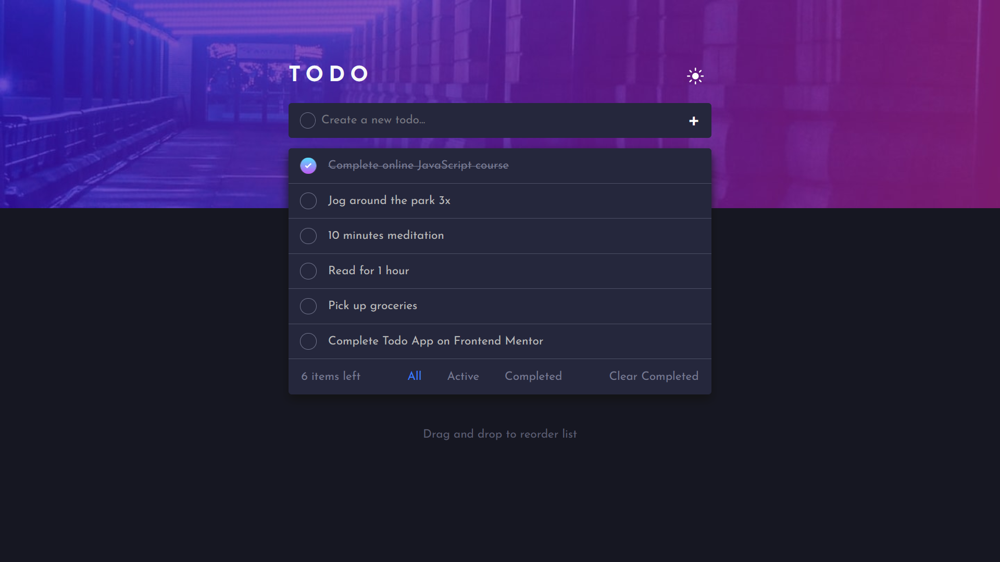

# Frontend Mentor - Todo app solution

This is a solution to the [Todo app challenge on Frontend Mentor](https://www.frontendmentor.io/challenges/todo-app-Su1_KokOW). Frontend Mentor challenges help you improve your coding skills by building realistic projects.

## Table of contents

- [Overview](#overview)
    - [The challenge](#the-challenge)
    - [Screenshot](#screenshot)
    - [Links](#links)
- [My process](#my-process)
    - [Built with](#built-with)
    - [Docker](#docker)
    - [Continued development](#continued-development)

**Note: Delete this note and update the table of contents based on what sections you keep.**

## Overview

### The challenge

Users should be able to:

- View the optimal layout for the app depending on their device's screen size
- See hover states for all interactive elements on the page
- Add new todos to the list
- Mark todos as complete
- Delete todos from the list
- Filter by all/active/complete todos
- Clear all completed todos
- Toggle light and dark mode
- **Bonus**: Drag and drop to reorder items on the list

### Screenshot



### Links

- Solution URL: [https://github.com/lesterdlb/minimal-api-todos](https://github.com/lesterdlb/minimal-api-todos)
- Live Site URL: [https://lesterdlb.github.io/minimal-api-todos/](https://lesterdlb.github.io/minimal-api-todos/)

## My process

### Built with

- Mobile-first workflow
- SCSS
- Typescript
- Axios
- [React](https://reactjs.org/) - JS library
- [React DnD](https://react-dnd.github.io/react-dnd/about) - Drag and drop library
- .NET Core 6.0 - Minimal API
- Docker

### Docker

To run the API, you need to have Docker installed. Then, run the following command:

```bash
git clone https://github.com/lesterdlb/minimal-api-todos.git
cd minimal-api-todos
docker-compose up
```

### Continued development

I decided to use Typescript for this project because I wanted to learn more about it. I also wanted to learn more about the Minimal API in .NET Core 6.0.

- Currently, the API is using an In Memory Database. Maybe I'll try to use a real database in the future.
- Add unit test for the API and the frontend.
- Add more features to the frontend, like animations, etc.
- Add more features to the API, like authentication, etc.
- 